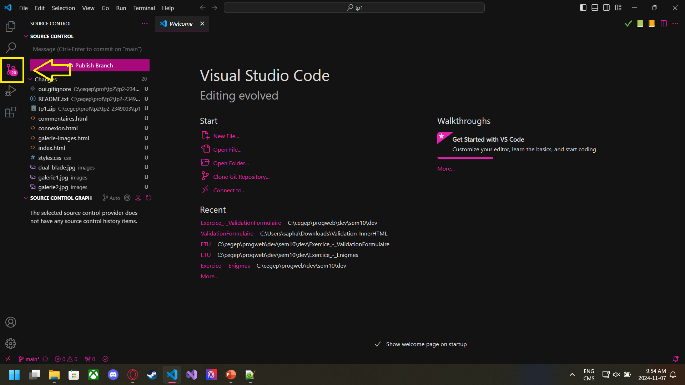
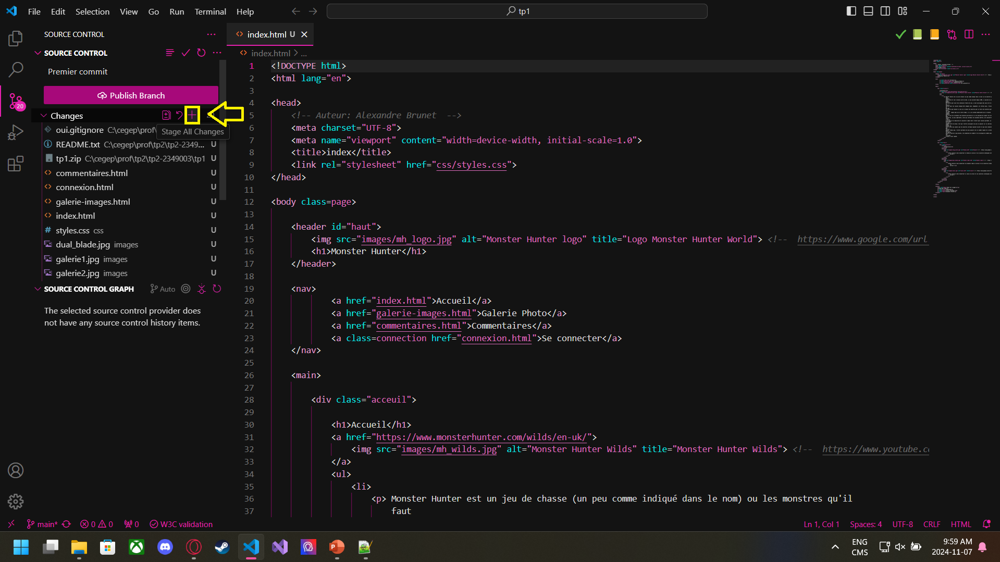
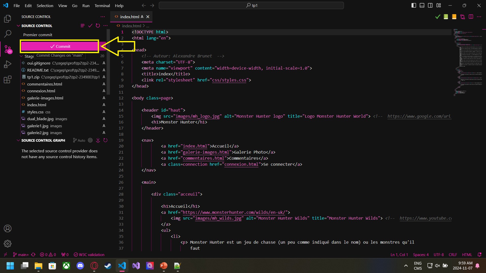

# Travail Pratique 2 - Git

Ce dépot contient le code d'un projet web fait dans le cours de Perspective Professionnelles.

## Faire un commit et un push dans Visual Studio Code

Voici comment faire un changement sur ce projet, et l'envoyer sur GitHub

1. Ouvrez le projet sur Visual Studio Code 

2. Allez dans l'onglet source control

3. Faites le petit plus

4. Appuyez sur "Commit"

## Contributeurs

- Alexandre Brunet - Auteur principal

## Licence
Copyright @ 2024 Alexandre Brunet. Tous droits réservés.
